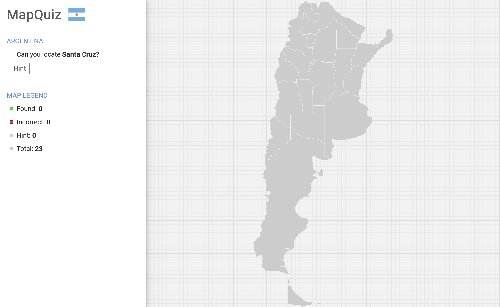

# MapQuiz

[Live Version](https://montee-diego.github.io/map-quiz/).

## Objective

The main objective of this small project is to dive deeper into making inline SVGs interactive. As
I worked on the project, I realized the need to pan and zoom the map in order for it to work on
mobile, so I wrote the functionality from scratch.

When coding the pan and zoom function I aimed for a similar behavior to Google Maps, since it is
likely that the user is familiar with it.

## Technical Overview

- Detached map logic from the SVG. Adding a new map can be done in minutes.
- Interaction with the SVG map is all handled in JS.
- Panning and Zooming built from scratch in JS.
- Panning and Zooming supports both desktop and mobile devices.
- On desktop, it detects mouse and touch inputs to support touchscreen laptops.
- On mobile, it detects one finger to pan and two fingers (pinch gesture) to zoom.

## Compatibility

- Tested on desktop: Firefox, Chrome and Edge
- Tested on mobile: Firefox, Chrome

## Comments

In order to keep a clean file structure and also because of the limitations of gh-pages relative
links, I had to use a few workarounds, for example placing the `background-image` style directly in
the body tag.
